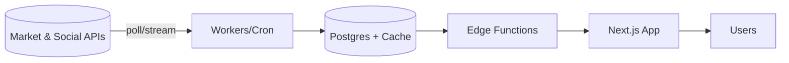

# DESIGN

Last updated: December 12, 2025 00:32

## MVP Scope — API-limited Crypto + Whales
- **Universe:** Top ~120 cryptocurrencies by market cap stored in DB (UI modules typically focus on the top 30).
- **Provider:** CoinGecko only (market + on-chain/top-trader endpoints) on the free tier.
- **Ingestion cadence:** Single backend worker (Node script, e.g. on Oracle VM) running every ~5 minutes, performing **one batched** CoinGecko request per run and writing into Supabase.
- **Stored data:**
  - Per-coin snapshots (price, market cap, 24h volume, % changes).
  - Basic whale / smart-trader aggregates per coin where available (e.g., top trader PnL, net buy/sell, counts).
- **Client access:** Mobile app reads **only from Supabase** (via cached views / edge functions) plus light local storage caching for last-viewed lists and settings. No direct CoinGecko calls from the client.
- **Future work:** Sections below (full social feeds, realtime quotes hot-set, community feeds, etc.) remain **post-MVP** goals once API budget and infra are ready.

## Market Data Pipeline (implemented MVP)
- **Ingest script** (`scripts/ingest-coingecko.js`)
  - Runs as a long-lived Node process (locally or on a VM) using a 5-minute interval.
  - Uses the CoinGecko Demo API key against `https://api.coingecko.com/api/v3/coins/markets` with:
    - `vs_currency=usd`
    - `order=market_cap_desc`
    - `per_page=TOP_N` (currently `120`)
    - `price_change_percentage=1h,24h,7d`
  - On each run, performs **one request** and writes:
    - To `coins` (upsert by `coingecko_id`, with `symbol`, `name`, `rank`, `is_tracked=true`).
    - To `coin_snapshots` (one row per coin): `coin_id`, `ts`, `price_usd`, `market_cap_usd`, `volume_24h_usd`, `change_1h_pct`, `change_24h_pct`, `change_7d_pct`, and `raw` JSON.
    - To `ingest_runs` (status, start/finish timestamps, and optional error text) for monitoring.

- **DB view: `coin_latest_view`**
  - Convenience view that always returns the **latest snapshot per coin**.
  - Conceptual definition:
    - For each row in `coins` (where `is_tracked = true`), join `coin_snapshots` on `coin_id` and pick the snapshot with the maximum `ts`.
    - Exposes: `coin_id`, `coingecko_id`, `symbol`, `name`, `rank`, `price_usd`, `market_cap_usd`, `volume_24h_usd`, `change_1h_pct`, `change_24h_pct`, `change_7d_pct`, and `ts`.

- **Home — AI Highlights (Balanced | FOMO | Yoink)**
  - On mount and pull-to-refresh, Home calls Supabase:
    - `from('coin_latest_view').select('symbol, name, price_usd, change_24h_pct, change_1h_pct, volume_24h_usd, rank').order('rank').limit(120)`.
  - The client derives three highlight lists from the same dataset:
    - `Balanced`: top N by `rank` (large-cap majors).
    - `FOMO`: top N by **24h % change** (gainers).
    - `Yoink`: top N by **1h % change** (short-term movers).
  - Each highlight row keeps:
    - `symbol`, `name`, formatted `price`, `change` (%), and an approximate absolute `changeValue` (price × %).
  - If Supabase or the view is unavailable, the app falls back to a crypto-only mock list so UI remains usable.

- **Explore — Live Coins lists**
  - Explore tab also loads from `coin_latest_view` (same select as above) and derives:
    - `Volume`: top coins sorted by `volume_24h_usd`.
    - `Gainers`: top coins with positive `change_24h_pct`.
    - `Losers`: top coins with negative `change_24h_pct`.
    - `Popular`: top coins by `rank` (market-cap order).
    - `Trades`: currently uses the same ordering as `Volume` as a proxy.
  - The ticker at the top of Explore rotates through a subset of the highest-ranked coins, displaying `symbol`, formatted `price_usd`, and `change_24h_pct`.

- **SVG Sparklines (5-minute history)**
  - `CoinSparkline` (`components/ui/coin-sparkline.tsx`) uses `react-native-svg` to draw a small price line chart per coin.
  - For a given `symbol`, it:
    - Looks up `coins.id` by `symbol`.
    - Queries `coin_snapshots` for that `coin_id`, ordered by `ts asc`, limited to the last ~36 points (≈3 hours at a 5-minute cadence).
    - Normalizes `price_usd` values into a 0–1 range and maps them into an SVG `Polyline` path (width × height), producing a minimalist sparkline.
  - Currently used for the **top five rows** in the AI Highlights lists on Home; remaining rows use a lightweight placeholder chart.

## Architecture

## Data Model (initial)
- `symbols` (symbol, exchange, sector, metadata)
- `quotes_intraday` (symbol, ts, price, volume, change%)
- `daily_agg` (symbol, date, ohlc, gap%, rel_vol)
- `social_mentions` (source, symbol, ts, score)
- `scouters` (user_id, name, rules JSON, schedule)
- `saved_lists` (user_id, name) and `saved_list_items` (list_id, symbol)
- `signals` (symbol, ts, type, score, source)

## Scouter Rules Examples
- Bullish: `change_5m >= X` AND `rel_vol >= Y`
- Bearish: `change_5m <= -X` AND `rel_vol >= Y`
- Gap Up/Down: `gap_open >= X` (or <= -X)
- Penny/Coin: `price <= 1`
- Sector buckets: `sector IN (AI, Oil, Quantum, …)`
- Meme: `social_mentions_score >= T`

## MVP Scope
- Landing modules: Extreme Down, Extreme Up, Meme Movers, Coin Stocks, Sector Highlights, Reddit Picks Top 10.
- Scouter builder: basic numeric comparators and preset templates.
- Saved lists: add/remove symbols, quick view.
- Search: small top search for symbols.

## Data Cadence (baseline)
- Daily full sync pre-market for all symbols.
- Intraday polling: tracked universe filtered by rules (e.g., change%, rel_vol) to respect limits.
- Social: Reddit daily summary + hourly refresh for trending.

## Performance & Cost
- Cache hot signals; store deltas not full ticks.
- Use server-side evaluation of rules; send only top N per bucket.

## Security
- RLS on all user-owned tables. Public read views for non-PII market data.
- **Market data RLS (implemented):**
  - `coins` and `coin_snapshots` have Row Level Security **enabled**.
  - Anonymous and authenticated clients (`EXPO_PUBLIC_SUPABASE_ANON_KEY`) can **only `SELECT`** from these tables (including via `coin_latest_view`); they **cannot write**.
  - All writes to `coins` / `coin_snapshots` / `ingest_runs` are performed by the backend ingest worker using a **service-role key** loaded from environment (`EXPO_PUBLIC_SUPABASE_ROLE_KEY` or `SUPABASE_SERVICE_ROLE_KEY`) and must never be exposed to the client.
  - Internal tables `ingest_runs`, `coin_whale_metrics`, and `coin_top_traders` also have RLS enabled with **no anon/auth policies**, making them backend-only.
  - This separation means the mobile app can freely read non-PII market data while ingestion and internal metrics remain fully protected.

## Navigation (5 Tabs Max)
- App uses exactly 5 bottom tabs.
 - Final tabs and order:
  1) `Home` — dopamine modules and entry to `AI Highlights` (which contains `Balanced | FOMO | Stonky!`)
  2) `Scouters` — create/manage scouters (presets + custom rules)
  3) `Explore` — discovery: sectors, coin stocks, meme movers, Reddit Top 10
  4) `Saved` — saved lists/watchlists
  5) `Menu` (or `Profile`) — wallet, daily claim, rewarded ads, settings

## AI Highlights Module (Balanced | FOMO | Stonky!)
- Tabs: `Balanced`, `FOMO`, `Stonky!` (show-only; not recommendations).
- List sizes: each tab maintains up to `13` live items (rotating as market changes).
- Preview: top `3` items shown; remaining `10` blurred until unlock.
- Unlocking:
  - Costs per section: Balanced `1 Coin`, FOMO `2 Coins`, Stonky! `3 Coins`.
  - Unlock grants `24h` access from unlock time, per user per section.
  - During access window, list remains unblurred and updates live.
- State chips: optional badges `Super Dangerous`, `Super Stonky`, `Cowards` as context labels (no extra cost).

## Wallet & Access Model
- `user_wallet`:
  - `user_id` PK/FK
  - `coins` int (non-negative)
  - `last_daily_claim_at` timestamptz (null if never)
  - `ads_viewed_today` int, `ads_viewed_reset_at` timestamptz
- `unlock_access`:
  - `user_id` PK part
  - `section` enum('balanced','fomo','stonky') PK part
  - `expires_at` timestamptz
  - unique (user_id, section)
- `ai_highlights`:
  - `id` PK
  - `section` enum('balanced','fomo','stonky')
  - `symbol` text, `score` numeric, `ts` timestamptz
  - `meta` jsonb (reason, momentum metrics, social score, risk flags)
  - index on (section, ts desc)

## API Endpoints (Edge Functions)
- `GET /wallet` → balances and remaining ad views today
- `POST /wallet/claim-daily` → +4 Coins if not already claimed today
- `POST /ads/reward` → server-verified reward; +3 Coins if under 5/day cap
- `POST /unlock` { section } → spend coins per section and create/extend 24h access
- `GET /highlights?section=balanced` → returns up to 13; if locked, include top 3 and blur flag for rest

## Client UX States
- Locked section: show 3 items + blur, CTA: “Unlock (X Coins)” and “Watch Ad (+3 Coins)” with remaining ads count.
- Unlocked section: show all 13 (or current count) live; show `time remaining` badge (hh:mm).
- Wallet pill: shows Coins, + daily claim button (once per day), and ad reward button with daily counter.

## Rules & Guards
- All coin deductions and ad rewards are server-authorized transactions.
- Enforce per-device/account caps for ads (5/day) and cooldowns.
- Do not expose provider keys; serve from cached DB layers.

## Realtime Quotes
- Goal: deliver a ~50 ms perceived update while staying within provider limits and indie budget.
- Ingestion:
  - Prefer WebSocket/tick stream (provider) → server coalescer (50–100 ms buffer per symbol).
  - Fallback: batch polling for hot set at provider-safe cadence (e.g., 1 s).
- Hot set sizing:
  - Maintain `50–200` symbols at fast cadence (AI Highlights sections, user watchlists, viewport-visible symbols).
  - Warm set updates `5–15 s`; cold set `30–60 s` or daily aggregates only.
- Caching & storage:
  - `latest_quotes` kept in memory cache for fan-out and quick API reads.
  - Persist to Postgres in `1 s` buckets in `quotes_intraday` or on `≥0.1%` price change.
- Fan-out to clients:
  - Use Supabase Realtime or custom SSE/WebSocket channel per section/symbol-list.
  - UI repaint throttled to `200–300 ms` (users can’t perceive faster; saves battery).
- Symbol selection policy:
  - Always include AI Highlights’ current 13 per section, plus any user watchlist symbols and those on screen.
  - Preload a small margin around the viewport; drop symbols when scrolled away.
- Cost controls:
  - Batch subscriptions/requests; write deltas only; backoff when calm, burst when volatile.

## Community & Feeds
- Location: `Explore` tab includes a top segment control: `Recommended | Following | News | Content`.
- Feed layout (list item):
  - Header row: `[user avatar] nickname`
  - Subheader: `[time posted]` (two-line layout when media present)
  - Title (optional)
  - Content (collapsed to ~3 lines) with `(read more)` expander
  - Footer actions: `[likes: N] [comments: N] [reposts: N] [share] [···]`
  - Overflow `···` menu: `Save`, `Follow`, `Block user`, `Report`
- Sections:
  - Immediately under segments: posts list (infinite scroll)
  - "Hot posts" module: shows spotlighted 3 posts with `Check all` and `Refresh more` control

### Data Model (community)
- `profiles` (user_id, nickname, avatar_url, bio, created_at)
- `follows` (follower_id, followee_id, created_at, unique(follower_id, followee_id))
- `posts` (id, user_id, title, content, media JSONB, created_at, updated_at, visibility)
- `post_likes` (user_id, post_id, created_at, unique(user_id, post_id))
- `post_reposts` (user_id, post_id, created_at, unique(user_id, post_id))
- `post_saves` (user_id, post_id, created_at, unique(user_id, post_id))
- `post_reports` (id, post_id, reporter_id, reason, created_at, status)
- `comments` (id, post_id, user_id, content, created_at, parent_id nullable)
- `comment_likes` (user_id, comment_id, created_at, unique(user_id, comment_id))
- `spotlight_posts` (post_id, score, window_start, window_end)
- Indices for feeds: (created_at desc), engagement score, and follows joins

### Feeds Logic
- `Recommended`: blend of engagement score, recency, and similarity to followed topics/users; exclude blocked users.
- `Following`: posts by followed users ordered by time, minor boosts for high engagement.
- `News`: curated or ingested headlines mapped to symbols; render as post-like cards.
- `Content`: long-form/how-tos/market education tagged posts.
- Infinite scroll with backfill and lightweight prefetch.

### Community Endpoints
- `GET /feed?type=recommended|following|news|content&cursor=` — returns paginated posts
- `GET /posts/:id` — fetch a post and comments (paginated)
- `POST /posts` — create post (title/content/media)
- `POST /posts/:id/like` — toggle like
- `POST /posts/:id/repost` — toggle repost
- `POST /posts/:id/save` — toggle save
- `POST /posts/:id/report` — create report with reason
- `POST /follows/:userId` — follow/unfollow
- `GET /users/:userId` — profile and recent posts

### Moderation & Safety
- RLS: users edit/delete only their content; admins/mods can moderate.
- Rate limits on posting and actions to prevent spam.
- Profanity/abuse filters on `posts` and `comments`; image moderation stub.
- Reporting workflow with statuses and escalation.
